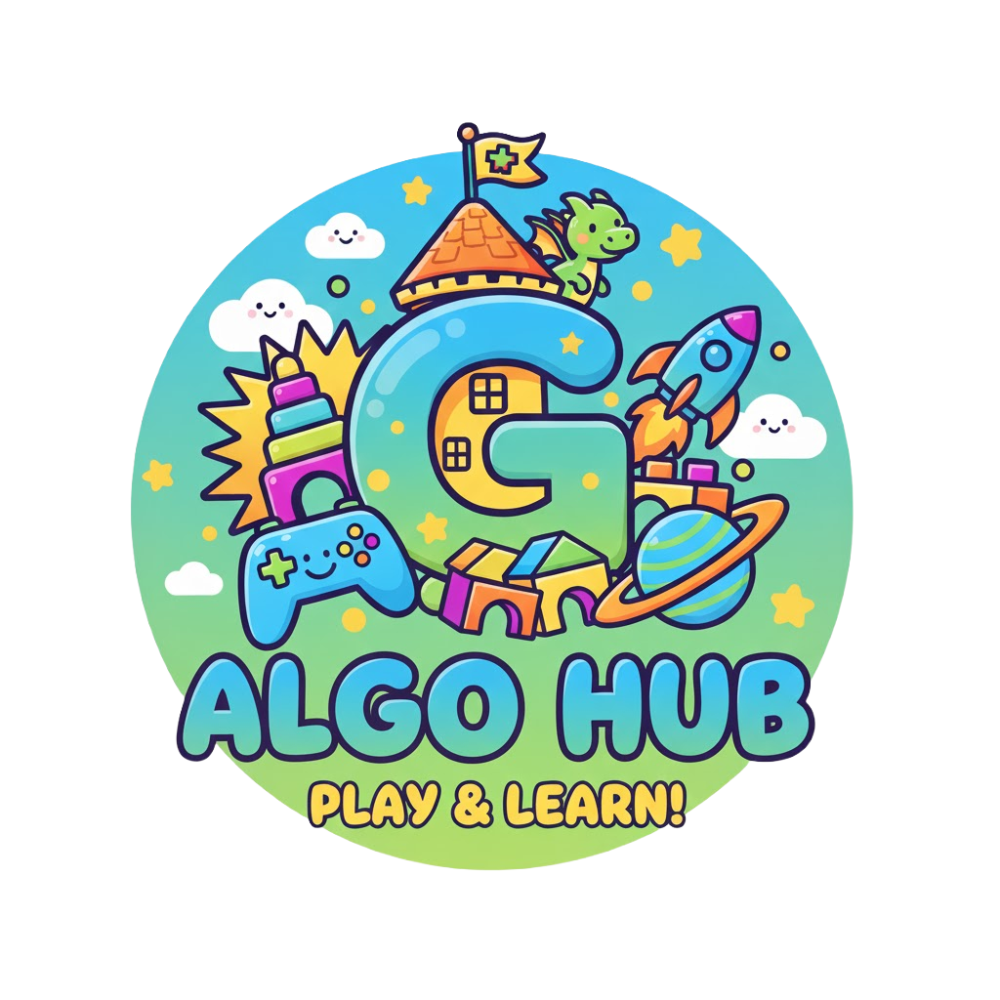

<p align="center">
	
</p>

# AlgoHub

AlgoHub is a Next.js playground that turns classic data-structures-and-algorithms practice into a set of cinematic mini-games. The hub blends Supabase-powered progression, animated UI, and WebGL scenes built with `@react-three/fiber` to deliver interactive lessons you can replay anywhere.

## Highlights

- **Cinematic landing experience** with iris transitions, animated cursors, global audio, and profile quick-access.
- **Supabase integration** for auth, profile data, achievements, and media uploads (license card, signatures).
- **Shared audio bus** that hands off between the global music player and per-game tracks.
- **Custom hook wrappers** (`useEffect`, `useMemo`, etc.) instrumented for React 19 streaming safety across the App Router.
- **Responsive controls**: keyboard for desktop, on-screen joystick (pointer + touch) for touch devices.

## Games

Playable and in-development experiences surface inside the Learn Carousel (`app/components/sections/GameScroller.tsx`).

| Title | Status | What you'll learn |
| --- | --- | --- |
| **Stack 'Em Queue** | Playable | Navigate a 3D parking lot to master stacks, queues, and state transitions while managing guard interactions and parking markers. |
| **Coming Soon!** | Coming soon | no description yet. |
| **Coming Soon!** | Coming soon | no description yet. |
| **Coming Soon!** | Coming soon | no description yet. |

### Stack 'Em Queue Snapshot

- Built with `@react-three/fiber`, `three`, and custom camera rigs.
- Queue management logic lives in `app/learn/parking/ParkingScene.jsx` with helpers in `hooks/` and `lib/`.
- Gameplay loop includes queue markers, countdown triggers, Supabase-powered license validation, and optional fast-forward.
- Mobile joystick: multi-input handling with pointer/touch fallbacks (`MobileJoystick` component inside `ParkingScene.jsx`).

## Tech Stack

- **Framework**: Next.js 16 (App Router, React 19, Suspense-first architecture)
- **3D & Animation**: three.js, @react-three/fiber, @react-three/drei, GSAP
- **Auth & Data**: Supabase (client + service role accessors)
- **Styling**: Tailwind CSS 4 + custom shaders and utility classes
- **Audio**: Custom Web Audio bus (`lib/audio/*`) plus music/sfx routing between screens
- **Tooling**: TypeScript, ESLint 9, custom React hook wrappers (`hooks/`)

## Project Structure

```
actions/                Server actions (auth, profiles, achievements)
app/                    App Router pages, UI components, R3F scenes
	components/           Landing + learn section UI
	learn/parking/        Stack 'Em Queue 3D scene & helpers
hooks/                  React hook wrappers aligned with Suspense
lib/                    Shared utilities (audio, transition bus, Supabase clients)
public/                 Static assets (car models, HDRI maps, music, UI sprites)
types/                  Shared TypeScript types across server/client
```

## Getting Started

### Prerequisites

- Node.js 20+
- npm (ships with Node) — yarn/pnpm/bun also work with matching scripts
- Supabase project (for auth, storage, and achievements)

### Environment Variables

Create a `.env.local` at the workspace root with:

```
NEXT_PUBLIC_SUPABASE_URL=your-project-url
NEXT_PUBLIC_SUPABASE_ANON_KEY=public-anon-key
SUPABASE_SERVICE_ROLE_KEY=service-role-key
```

`SUPABASE_SERVICE_ROLE_KEY` is required for server actions that query achievements. In non-production setups you can reuse the anon key, but service-role keys should be kept server-side in real deployments.

### Install & Run

```bash
npm install
npm run dev
```

Visit `http://localhost:3000` to explore the landing experience. The Learn carousel lives at `/learn`, and the primary game scene at `/learn/parking`.

### Build & Quality

```bash
# Production build
npm run build

# Start optimized server
npm run start

# Static analysis (ESLint + Next rules)

```

## Gameplay Flow

1. **Landing:** Sign in or continue as guest. Global music (`public/audio`) plays via the landing music bus.
2. **Learn Carousel:** Scroll between game concepts. Starting *Stack 'Em Queue* triggers camera capture and license card modals.
3. **Stack 'Em Queue:** Drive with WASD/arrow keys or the mobile joystick. Queue markers and the security guard trigger cinematic camera moves and countdown overlays.
4. **Progress Saving:** License snapshots and signatures upload to Supabase storage, while achievements and profiles sync via server actions.

## Assets & Audio

- 3D assets live under `public/models`, `public/car-models`, and `public/car-show` (GLTF + textures + HDR environments).
- Audio loops and SFX can be found in `public/audio` and `public/car-audio`.
- Custom license textures and UI sprites sit alongside the main `public` directory.

## Roadmap

- Expand achievements and progression UI (profile dashboard, streaks).
- Ship Graph Quest prototype with graph traversal visualisations.
- Introduce collaborative challenges and leaderboards.
- Add automated tests (unit + integration) for queue logic and joystick controls.

## Contributing

1. Fork & clone the repo.
2. Create a feature branch from `dev`.
3. Run `npm run lint` and exercise the parking scene on desktop + mobile before opening a PR.
4. Describe Supabase schema changes clearly—migrations are managed outside this repo.

## Deployment

AlgoHub deploys like any App Router project. Provision Supabase environment variables in your hosting provider (Vercel, Netlify, etc.) and ensure storage buckets exist for `licenses/` and `signatures/` uploads. Run `npm run build` during your CI step.

## License

Pending — please reach out to the maintainers for reuse or distribution questions.
