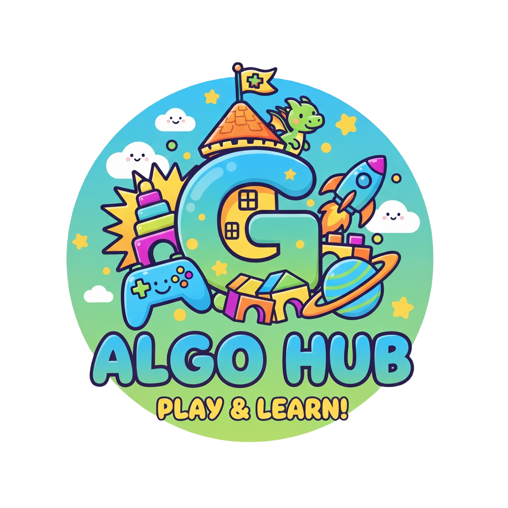
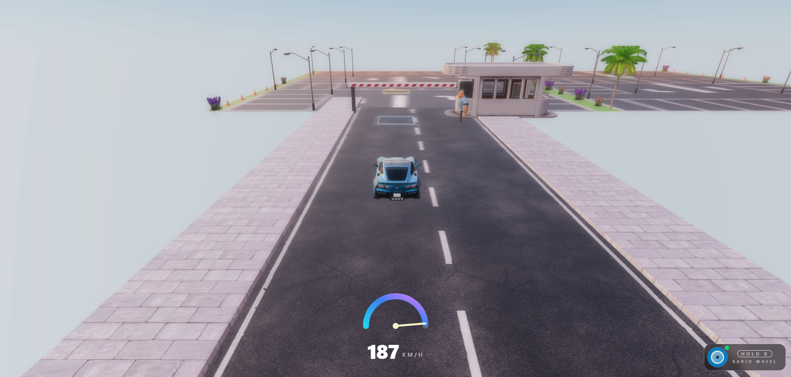
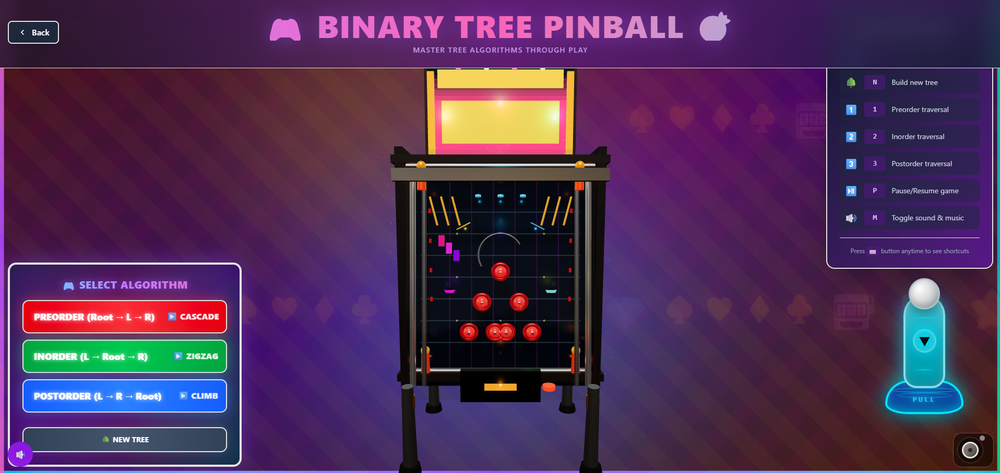
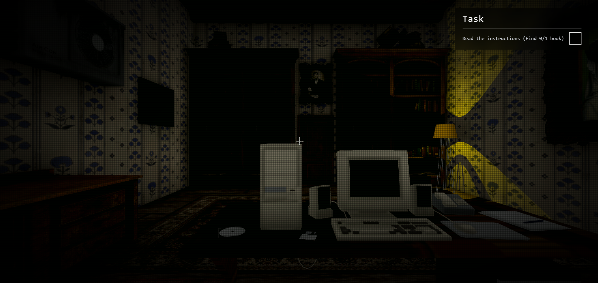
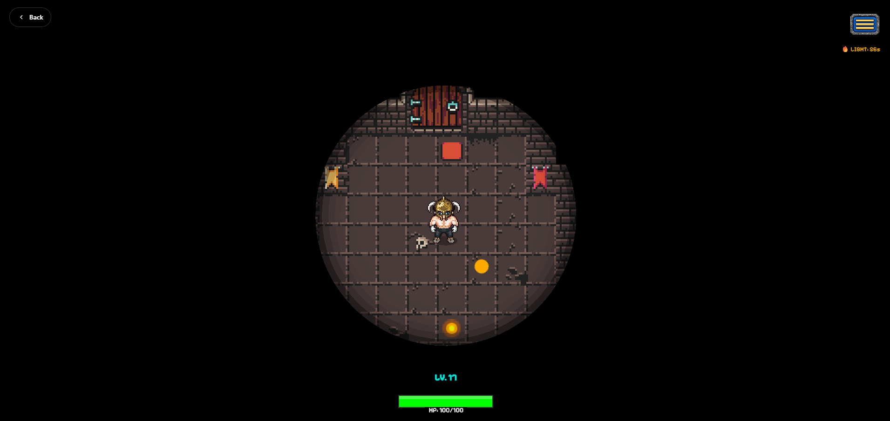

<p align="center">
	
</p>

# AlgoHub

AlgoHub is a Next.js playground that turns classic data-structures-and-algorithms practice into a set of cinematic mini-games. The hub blends Supabase-powered progression, animated UI, and WebGL scenes built with `@react-three/fiber` to deliver interactive lessons you can replay anywhere.

## Highlights

- **Cinematic landing experience** with iris transitions, animated cursors, global audio, and profile quick-access.
- **Supabase integration** for auth, profile data, achievements, and media uploads (license card, signatures).
- **Shared audio bus** that hands off between the global music player and per-game tracks.
- **Custom hook wrappers** (`useEffect`, `useMemo`, etc.) instrumented for React 19 streaming safety across the App Router.
- **Responsive controls**: keyboard for desktop, on-screen joystick (pointer + touch) for touch devices.

## Games

Playable and in-development experiences surface inside the Learn Carousel (`app/components/sections/GameScroller.tsx`).

| Title | Route | Status | What you'll learn |
| --- | --- | --- | --- |
| **Stack 'Em Queue** | `/learn/parking` | Playable | Stacks + queues fundamentals via a 3D parking lot loop (enqueue/dequeue, state transitions, visualizing structure changes). |
| **Binary Tree Pinball** | `/learn/pinball` | Playable | Binary tree traversals (preorder/inorder/postorder) in an arcade-style 3D pinball traversal runner. |
| **Tower of Hanoi** | `/learn/tower-of-hanoi` | Playable | Recursion, constraints, and optimal move sequences through a staged UI that escalates into a terminal-style “system” flow. |
| **Dungeon** | `/learn/dungeon` | Playable | Phaser-based mini-game experience (client-only) used as an interactive playground inside the Learn hub. |

## Snapshots

### Stack 'Em Queue

- 
- Built with `@react-three/fiber`, `three`, and custom camera rigs.
- Queue management logic lives in `app/learn/parking/ParkingScene.jsx` with helpers in `hooks/` and `lib/`.
- Gameplay loop includes queue markers, countdown triggers, Supabase-powered license validation, and optional fast-forward.
- Mobile joystick: multi-input handling with pointer/touch fallbacks (`MobileJoystick` component inside `ParkingScene.jsx`).

### Binary Tree Pinball

- 

- Enter a list of numbers to build a BST, then visualize it in 3D.
- Choose a traversal (preorder / inorder / postorder) and watch the sequence play out.
- Traversal and positioning logic live under `lib/pinball/`.

### Critical Migration

- 

- Solve the Tower of Hanoi by moving disks between towers under the classic size constraints.
- The experience is presented as a staged UI flow (logo → desktop → game → terminal-style sequence).
- The flow and state live under `app/learn/tower-of-hanoi/`.

### Dungeon Quest

- 

- Client-only Phaser experience loaded via dynamic import.
- Uses sprite/map assets from `public/sprite/` and related game files under `app/learn/dungeon/`.

## Tech Stack

- **Framework**: Next.js 16 (App Router, React 19, Suspense-first architecture)
- **3D & Animation**: three.js, @react-three/fiber, @react-three/drei, GSAP
- **Auth & Data**: Supabase (client + service role accessors)
- **Styling**: Tailwind CSS 4 + custom shaders and utility classes
- **Audio**: Custom Web Audio bus (`lib/audio/*`) plus music/sfx routing between screens
- **Tooling**: TypeScript, ESLint 9, custom React hook wrappers (`hooks/`)

## Security Testing

This project has been tested using the following tools during security validation activities:

- OWASP ZAP
- Nmap
- Wireshark
- Burp Suite

Notes:

- Network scanning and interception tools should only be used against environments you own or have explicit permission to test.
- Any detailed findings (if applicable) are tracked outside this repository; this README intentionally does not publish exploit details.

## SBOM (Software Bill of Materials)

The repository includes an SBOM section here to document runtime components, libraries, dependency versions, origins, and vulnerability status.

Important: the `sbom/` folder in this repo is currently empty, and no vulnerability scan report output is committed. Because of that, the “Vulnerabilities” column below reflects what is documented in-repo (not a guarantee of “no vulnerabilities”).

### Components & Dependencies

| Component | Purpose | Key Dependencies (version as declared) | Origin | Vulnerabilities (in-repo) |
| --- | --- | --- | --- | --- |
| **Web App (Next.js / App Router)** | UI, routing, server rendering, API routes | `next@^16.0.7`, `react@19.2.0`, `react-dom@19.2.0` | npm registry | No report committed (run `npm audit` / SBOM tooling) |
| **Supabase Integration** | Auth, profiles, achievements, storage | `@supabase/supabase-js@^2.80.0` | npm registry | No report committed (run `npm audit` / SBOM tooling) |
| **3D / WebGL Games** | Three.js scenes and interactions | `three@^0.181.0`, `@react-three/fiber@^9.4.0`, `@react-three/drei@^10.7.6`, `@react-three/cannon@^6.6.0`, `gsap@^3.13.0` | npm registry | No report committed (run `npm audit` / SBOM tooling) |
| **Arcade / 2D Engine** | Phaser-based client game(s) | `phaser@^3.90.0` | npm registry | No report committed (run `npm audit` / SBOM tooling) |
| **Realtime / Multiplayer Plumbing** | Socket messaging (where used) | `socket.io@^4.8.3`, `socket.io-client@^4.8.3` | npm registry | No report committed (run `npm audit` / SBOM tooling) |
| **AI Integration (optional)** | AI utilities where enabled | `@google/generative-ai@^0.24.1` | npm registry | No report committed (run `npm audit` / SBOM tooling) |
| **Validation / Utilities** | Input validation and class composition | `zod@^4.3.4`, `clsx@^2.1.1`, `class-variance-authority@^0.7.1`, `tailwind-merge@^3.3.1` | npm registry | No report committed (run `npm audit` / SBOM tooling) |
| **UI Icons** | Icon set | `lucide-react@^0.552.0` | npm registry | No report committed (run `npm audit` / SBOM tooling) |
| **Build / Type / Lint Tooling** | TypeScript + lint rules | `typescript@^5`, `eslint@^9`, `eslint-config-next@16.0.1`, `eslint-plugin-security@^3.0.1`, `@types/*` | npm registry | No report committed (run `npm audit` / SBOM tooling) |
| **Unit Testing** | Jest unit tests | `jest@^30.2.0`, `@types/jest@^30.0.0` | npm registry | No report committed (run `npm audit` / SBOM tooling) |

## Project Structure

```
actions/                 Server actions (auth, profiles, achievements, admin)
app/                     Next.js App Router pages, UI components, game routes
	admin/                 Admin dashboard pages
	api/                   App Router API routes (scoped under app)
	components/            Landing + learn section UI and shared UI primitives
	learn/                 Game routes (dungeon, parking, pinball, tower-of-hanoi)
	profile/               Profile page
	sign-in/               Sign-in page
components/              Shared components (sections, ui)
credits/                 Credits page
data/                    Local JSON data (e.g., developers list)
hooks/                   Custom React hooks + React wrapper hooks
lib/                     Shared utilities (audio, parking/pinball helpers, Supabase, transitions)
pages/api/               Pages Router API (Socket.IO endpoint)
public/                  Static assets (models, textures, audio, sprites)
sbom/                    SBOM artifacts folder (currently empty)
types/                   Shared TypeScript types
unit_tests/              Jest unit tests
```

## Getting Started

### Prerequisites

- Node.js 20+
- npm (ships with Node) — yarn/pnpm/bun also work with matching scripts
- Supabase project (for auth, storage, and achievements)

### Environment Variables

Create a `.env.local` at the workspace root with:

```
NEXT_PUBLIC_SUPABASE_URL=your-project-url
NEXT_PUBLIC_SUPABASE_ANON_KEY=public-anon-key
SUPABASE_SERVICE_ROLE_KEY=service-role-key
```

`SUPABASE_SERVICE_ROLE_KEY` is required for server actions that query achievements. In non-production setups you can reuse the anon key, but service-role keys should be kept server-side in real deployments.

### Install & Run

```bash
npm install
npm run dev
```

Visit `http://localhost:3000` to explore the landing experience. The Learn carousel lives at `/learn`, and the primary game scene at `/learn/parking`.

### Build & Quality

```bash
# Production build
npm run build

# Start optimized server
npm run start

# Static analysis (ESLint + Next rules)

```

## Integration Testing (Postman)

Integration tests are maintained as a Postman Collection and can be run in Postman or headlessly via Newman.

### Run locally (Newman)

Run the integration suite (starts a dev server and runs Newman against it):

```bash
npm run test:integration
```

If you already have a server running (or want to point at a different `baseUrl` in Postman), run only the Newman step:

```bash
npm run test:integration:only
```

### Environment toggles

- The runner uses [postman/AlgoHub.local.postman_environment.json](postman/AlgoHub.local.postman_environment.json).
- Set `EXPECT_EXTERNAL_SERVICES` to `true` if your `.env.local` is configured for Supabase/Gemini and you want those routes to be required to return `200`.
- Leave it as `false` to allow external-service routes to return `{ "error": "..." }` (useful for running the suite without secrets configured).

## Gameplay Flow

1. **Landing:** Sign in (or continue as guest). Global music plays via the shared audio bus.
2. **Learn Carousel (`/learn`):** Browse and launch games.
3. **Play a game:**
	- **Stack 'Em Queue (`/learn/parking`):** Drive through a 3D parking lot scenario to practice stack/queue operations with in-world triggers and overlays.
	- **Binary Tree Pinball (`/learn/pinball`):** Build a BST from input values, choose a traversal type, then watch the traversal play out as a pinball sequence.
	- **Tower of Hanoi (`/learn/tower-of-hanoi`):** Play the classic disk-moving puzzle through a staged UI flow (including a terminal-style sequence).
	- **Dungeon (`/learn/dungeon`):** Launch a Phaser-based client-only game experience.
4. **Progress Saving (where enabled):** Profiles, achievements, and uploads (license snapshots/signatures) sync through Supabase + server actions.

## Assets & Audio

- 3D assets live under `public/models`, `public/car-models`, and `public/car-show` (GLTF + textures + HDR environments).
- Audio loops and SFX can be found in `public/audio` and `public/car-audio`.
- Custom license textures and UI sprites sit alongside the main `public` directory.

## Deployment

AlgoHub deploys like any App Router project. Provision Supabase environment variables in your hosting provider (Vercel, Netlify, etc.) and ensure storage buckets exist for `licenses/` and `signatures/` uploads. Run `npm run build` during your CI step.

## License

(MIT License)[https://github.com/red-sakai/Algohub/blob/main/LICENSE]
